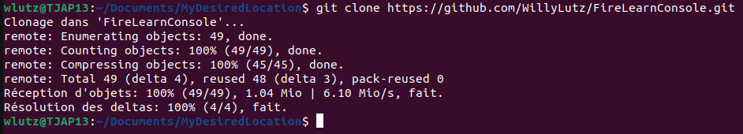
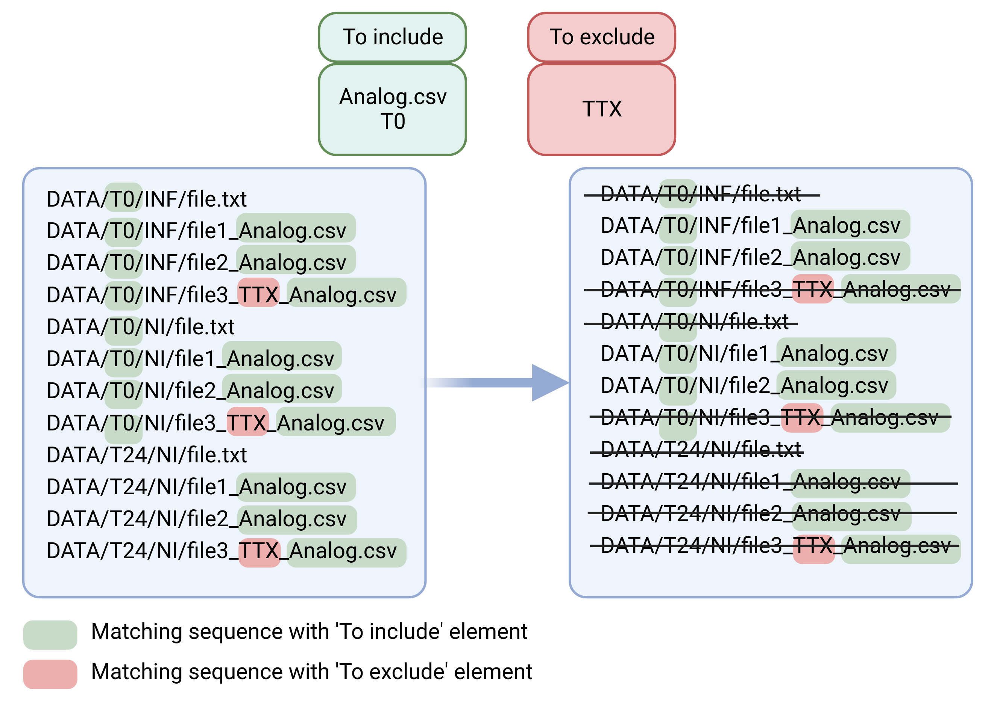
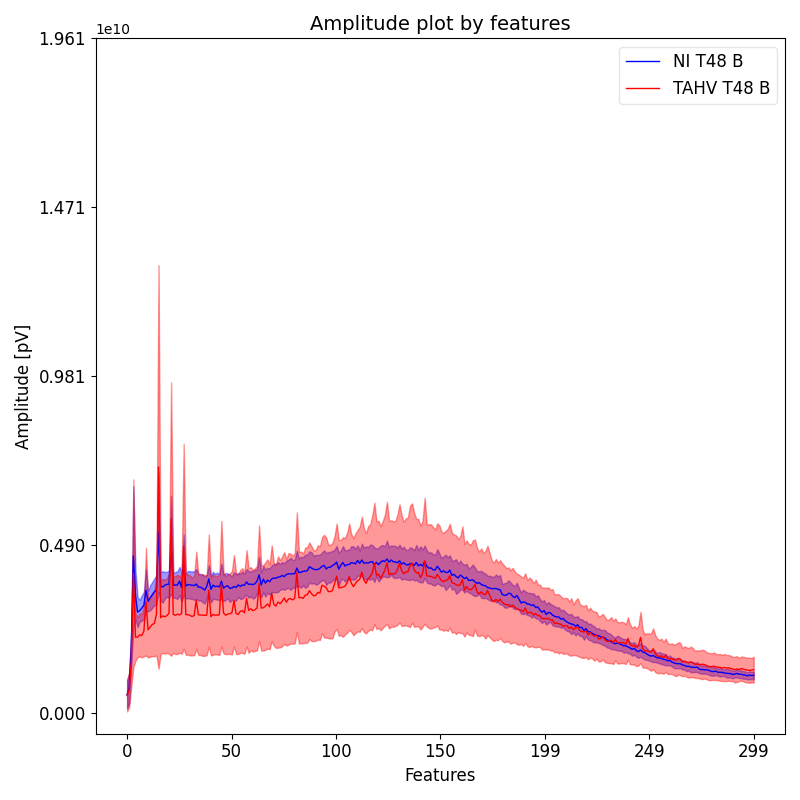
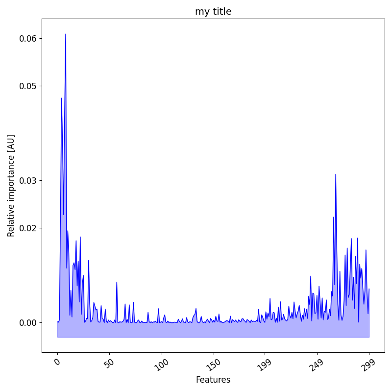
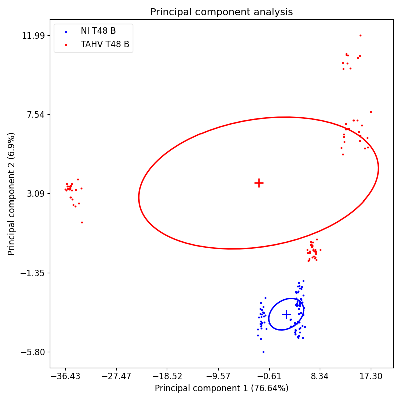
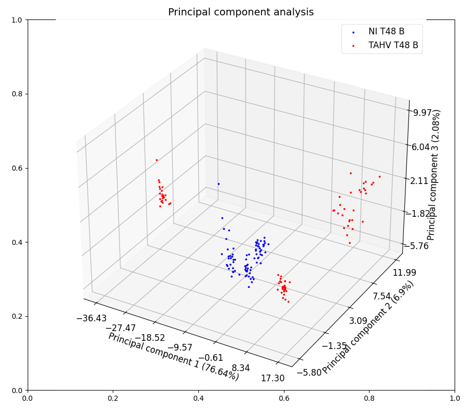
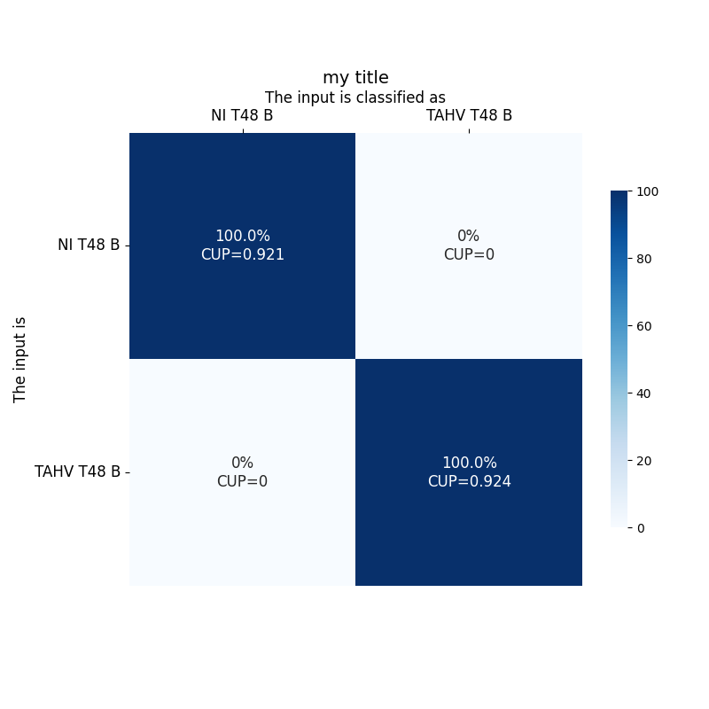
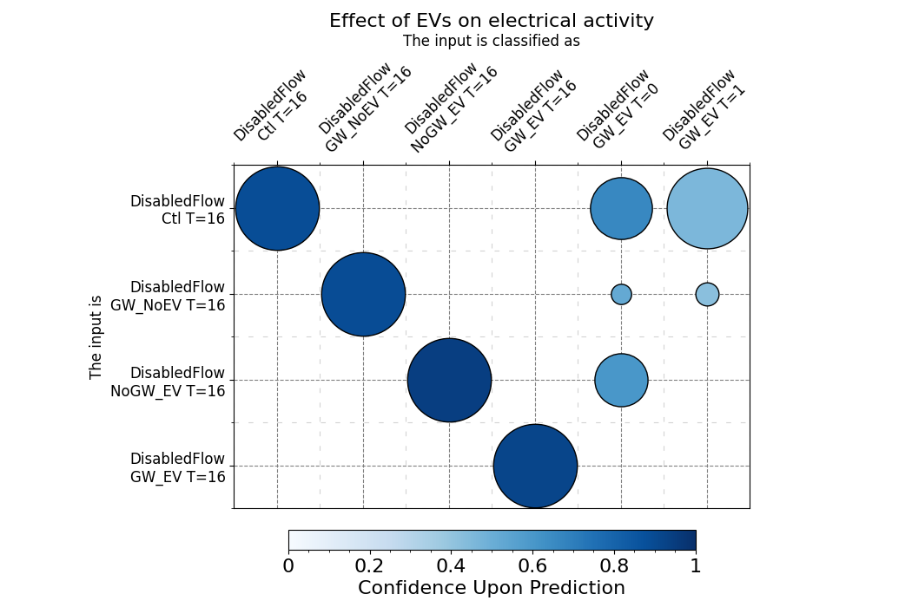

# FireLearn Console v0.2.4

FireLearn Console (FLC) is a console-driven application developed by Willy Lutz that 
aims to provide an easy way to analyze multiple numerical data, such as electrical 
recordings. It uses the `fiiireflyyy` python library by the same author, to provide 
machine learning and other processing and analytical tools, without the need to write a single 
line of code. The only thing the user will be required to do is to modify the 
`.toml` configuration files to their needs. And of course the command line to start the application.

Everything the user needs to know will be explained thoroughly in this document.

# Table of contents

- [FireLearn Console v0.2.4](#firelearn-console-v024)
- [Table of contents](#table-of-contents)
- [Installation and usage](#installation-and-usage)
  - [Installation](#installation)
    - [Clone via git](#clone-via-git)
    - [Set up a virtual environment](#set-up-a-virtual-environment)
    - [Make the project executable](#make-the-project-executable)
    - [Update the project](#update-the-project)
  - [How to use](#how-to-use)
    - [Available arguments](#available-arguments)
    - [The .toml configuration files](#the-toml-configuration-files)
- [Walkthrough](#walkthrough)
  - [Processing](#processing)
    - [Example: directory structure](#example-directory-structure)
    - [Sorting multiple files](#sorting-multiple-files)
      - [Selecting parent directory](#selecting-parent-directory)
      - [Include and exclude files for the processing](#include-and-exclude-files-for-the-processing)
      - [Indicating targets for learning](#indicating-targets-for-learning)
      - [Single file analysis](#single-file-analysis)
      - [Beheading](#beheading)
      - [Selecting rows](#selecting-rows)
      - [Selecting columns](#selecting-columns)
      - [Recordings down sampling](#recordings-down-sampling)
      - [Filtering](#filtering)
      - [Fast Fourier Transform](#fast-fourier-transform)
      - [Interpolation](#interpolation)
      - [Averaging columns](#averaging-columns)
      - [Resulting datasets](#resulting-datasets)
      - [Post-processing](#post-processing)
  - [Learning](#learning)
    - [Load and save](#load-and-save)
    - [Training and testing](#training-and-testing)
    - [Tuning the model](#tuning-the-model)
    - [Dataset selection and split](#dataset-selection-and-split)
  - [Analysis](#analysis)
    - [Common configuration variables](#common-configuration-variables)
    - [Simple plots](#simple-plots)
    - [Feature importance](#feature-importance)
    - [Principal Component Analysis (PCA)](#principal-component-analysis-pca)
    - [Confusion matrix](#confusion-matrix)
    - [Dotplot] (#dotplot)
- [Miscellaneous](#miscellaneous)
  - [Logging](#logging)
  - [Support](#support)
  - [Authors and acknowledgement](#authors-and-acknowledgement)
  - [Licence](#licence)
  - [Project status](#project-status)


# Installation and usage

No prior knowledge of console and command-line arguments is needed, although preferred. 
Everything will be explicit in this document.
However, you need to have `Python 3.10` or more installed on your system 
([https://www.python.org/downloads/](https://www.python.org/downloads/)), 
and `git` ([https://git-scm.com/downloads](https://git-scm.com/downloads)).

You can check their correct installaction by using respectively in the terminal
```console
python3 --version
```
and
```console
git --version
```
It should print th installed version, such as `Python 3.10.12` and `git version 2.34.1`.

## Installation
### Clone via git
Next is to clone the project locally on your system. To do so, open a terminal on the desired location to 
download the project.
Open a terminal window at this location, then enter the following command
```console
git clone https://github.com/WillyLutz/FireLearnConsole.git
```

wait for a bit, and you should have a following result as following

### Set up a virtual environment
It is then recommended to set up a virtual environment. If you wish not, go to the next section.
To set up the environment, use the following command.
```console
python3 -m venv /your/path/MyDesiredLocation/FireLearnConsole/venv
```
Change the path indicated here to your actual path. Any name can replace `venv`, as you see fit. However,
if you do so keep in mind you will have to adapt the other command accordingly.

For the moment, an automatic management of the virtual environment has not been implemented. So you will need to
activate the environment by using 
```console
source venv/bin/activate
```
while in the project directory. a `(venv)` should appear at the beginning of the line.

To deactivate it, simply use
```console
deactivate
```

Once activated, use
```console
pip install -r requirements.txt
```
It will then proceed to install the required dependencies for the project.

### Make the project executable
The last step is to make the main file executable. To do so, enter the directory `FireLearnConsole`.

Then use the command
```console
chmod +x firelearn.py
```
to grant executable permission to the file.
The project is now ready to use !

### Update the project
If you already have the project set up and want the latest version, you can easily update it. 
Go inside the FireLearnConsole directory, then use the command
```console
git pull origin master
```
It will be updated to the latest changes in the GitHub.
Then, activate your virtual environment and update the used libraries by using 
```console 
pip install -r requirements.txt
```
while in the project directory.
## How to use

To use the application, open a terminal and go to the project directory. Then 
[activate your virtual environment](#set-up-a-virtual-environment). 

You can now execute the application in your terminal by typing, as base synthax,
```console
python3 firelearn.py #ADD SOME ARGUMENTS
```
The arguments after will depend on what the user intends to do (processing, learning, analysis...)

The list of available arguments is [here](#available-arguments)
Each argument enables functionalities of the application, each one of them controlled independently by its configuration
file under a `.toml` extension. Those files contain the different parameters that can (and should) 
be tuned to the user needs.

### Available arguments
* `-p` Enables the processing, controlled by `processing.toml`
* `-l` Enables the learning, controlled by `learn.toml`
* `-c` Enables the confusion analysis, controlled by `confusion.toml`
* `-i` Enables the feature importances analysis, controlled by `feature_importances.toml`
* `-pca` Enables the PCA analysis, controlled by `pca.toml`
* `-plot` Enables the dataset plotting analysis, controlled by `simple_plot.toml`

If multiple arguments are in the command line, they will be executed in the order presented above.

### The .toml configuration files
Each one of the configuration files in `FireLearnConsole/config/` allow the user to fine tune the behavior of 
the application for each feature independently.
They are of the format `.toml`, which has the following architecture:

```toml
[category1]
var1 = '...'
var2 = '...'

   # comments on subcategory1
   [category1.subCategory1]
   sub_var1 = '...'
   sub_var2 = '...'
   
   [category1.subCategory2]
   sub_var1 = '...'
   sub_var2 = '...' # comments on sub_var2

[category2]
var1 = '...'
```
The indentation is not relevant, but is maintained for better readability. 
 You may encounter comments in the form `# lorem ipsum` that give 
specifications on the use of a certain category or variable.

You can edit them in any text file editor, given you respect the notation.

> 
> 
> You must not change the names of the variables, only their values.

> 
> 
> When modifying the variables value, make sure that they stay of their initial types (integers stay integers, 
> string stay string, lists stay lists...).


If needed, a small guide on how toml works is [available here](#https://toml.io/en/).

More specific use of our configuration files will be found in their relevant section.
# Walkthrough

## Processing
Configuration file : `processing.toml`

Enabled using `-p` command line argument.
### Example: directory structure
For this document we will proceed considering this recommended directory structure : 
```
DATA (most parent common directory)
│
└───-DRUG
│   └───T=0MIN
│   │   └───NI
│   │   │   |
│   │   │   file.txt
│   │   │   file1_Analog.csv
│   │   │   file2_Analog.csv
│   │   │   file3_Analog.csv
│   │   │   file4_Analog.csv
│   │   └───INF
│   │       |
│   │       [...]
│   └───T=24H
│       └───[...]
└───SOMEDRUG
│   └───[...]
└───SOMEOTHERDRUG
    └───[...]
```
### Sorting multiple files
This functionality aims at looking for and using multiple files under a common parent 
directory, no matter how distant it is. 

enables it by setting 
```toml
[filesorter]
enable_multiple = true # disable by setting 'false'
```

#### Selecting parent directory
```toml
[filesorter.multiple]
# Absolute path required
parent_directory="/my/path/to/parent/dir/DATA/-DRUG/T=24H"
```
The selected directory must be a parent of all the files you want to process.
For a multiple files processing, you __must__ set `enable_multiple = true`.

For instance, using [this directory structure](#example-directory-structure), all the files that
are children to the most parent directory (here `/DATA`) are subject to be comprised in the processing.

To specify which files to include or exclude of the processing, 
refer to [the include/exclude option](#include-and-exclude-files-for-the-processing).

#### Include and exclude files for the processing
```toml
[filesorter.multiple]
to_include = ['Analog.csv', ]
to_exclude = ['TTX', ]
```
With this functionality, you can specify which file to include or exclude from the selection.
Both the inclusion and exclusion works by looking at the content of the absolute paths of the files 
(e.g. `H:\Electrical activity\DATA\-DRUG\T=0MIN\INF\Electrode Raw Data1_Analog.csv`). 

As such, the inclusion uses the AND logic operator : 
**The file is included if ALL the `to_include` specifications are present in the absolute path**.
On the other hand, the exclusion uses the OR logic operation :
**The file is excluded if ANY of the `to_exclude` specifications are present in the absolute path**.
Combining both gates, a file will be included for the processing if its absolute path 
**contains all the `to include` specifications and none of the `to exclude` specifications**.



Those `to include` and `to exclude` specifications are case-sensitive, so `Analog.csv` is different 
from `analog.csv`.

To add a specification, type it in the corresponding entry, then either click on the `+` button, or press 
the `Return` key. To remove a specification, type it in the corresponding entry, then either click on the 
`-` button or press `Ctrl-BackSpace` combination.

E.g. : As per the previous figure, only the files that contains  "Analog.csv" **AND** "T0" **AND DO NOT CONTAIN** "TTX"
in their absolute paths will be used for further processing.
#### Indicating targets for learning
```toml
[filesorter.multiple.targets]
'NI' = 'Mock'
'INF' = 'Infected'
```
It is possible to make an entry correspond with a label for future processing, based on its path. 

To do so, you will need to create associations of 'key' and 'value', using the synthax
```toml
'key' = 'value'
```
indicate as the `key` a sequence of characters to find in the path of the file. Then indicate as the `value` 
the corresponding label. When creating the resulting files for the analysis, a label (`value`) will be assigned to 
the data using the `key` provided. 

E.g. : in the previous toml section, the label `Mock` will be assigned to the data if `NI` is comprised in the absolute
path of the file used. The label `Infected` will be assigned to the data if `INF` is comprised in the absolute
path of the file used. 

> 
> 
> Be it for including or excluding, the sequence will be searched in the absolute path and not
> only on the file name. 

> 
> 
> The said sequences does not search for "separated sequences" and does not recognise if the sequence
> is a word in itself. It will only look at the sequence character-wise. As such when choosing the 
> sequences you want to include or exclude, be aware of what can be in your absolute paths.
> 
> > E.g.: Your project is in a folder named 'HIV PROJECT', and further away in the children folders
> > you name the different recording conditions such as 'NI' (not infected), 'HIV' (infected by HIV)
> > BUT to select the files you specify in To exclude 'HIV', **all of your files will be excluded since
> > 'HIV' as a sequence is also present in the project folder 'HIV PROJECT' and not only as a 'condition'**.
> > 
> > To remediate to such issue, it is possible to look for the sequence '/HIV/' (use your operating system path 
> > separator) instead to ensure that we only look
> > at the folder named 'HIV' and not 'HIV PROJECT'.

#### Single file analysis
```toml
[filesorter.single]
# Absolute path required
file=""
```
In order to process a single file, provide a path to `file`. 
> 
> 
>You can not have the single file analysis enabled and
>the multiple files analysis enabled at the same time.

#### Beheading
```toml
[signal]
# putting value to 0 disables the parameter
behead = 6
```
Beheads the n first lines of the csv file (to use if there are metadata on the first lines 
of the csv file, for instance).
Be aware that after this step there must not be anything apart from the data and a row of headers, in the data file.

#### Selecting rows
```toml
[signal]
[signal.select_rows]
enable = false
start = 0  # first index for row selection
end = 0  # second index for row selection
```

Allow to select a range of rows for the processing. Note that the indexes `start` and `end` 
start count from the `behead` variable. Also, `start` < `end`.

#### Selecting columns
```toml
[signal]
index_col = "TimeStamp [µs]"

[signal.select_columns]
mode = "max" # select columns by their maximum metric
metric = "std"  # Metric used to select columns
number = 35  # number of columns to select, based on mode and metric
```
Allow to select the columns (electrodes, in case of MEA recordings) with a `mode` `metric` combination.
Any column that contains `TimeStamp [µs]` (case-sensitive) in its header will be ignored.
#### Recordings down sampling
```toml
[signal]
subdivide = 30
```
This functionality will divide row-wisely every file in `n` selected pieces of equal lengths.
e.g. In our walkthrough example, we use 1 minute long recordings.
Specifying a subdivision at `30` implies that the recordings will be divided in 30 pieces of 2 seconds.

> 
>
> If the [make resulting files as dataset](#post-processing) function is not used, be aware that each file
selected during the [selection process](#sorting-multiple-files) will generate an equal number of different
based on the [subdivision](#recordings-down-sampling).

#### Filtering
```toml
[signal.filtering]
enable = true
order = 3
sampling_frequency = 10000  # in Hz
type = 'highpass' # among 'highpass', 'lowpass', 'bandstop', 'bandpass'
first_freq = 50 # in Hz
second_freq = 0 # in Hz, only if 'bandstop' or 'bandpass'
```

Allow the user to apply a Butterworth filter to the data.

For the use of `lowpass` and `highpass` filters, the first frequency `first-freq` corresponds to the cut
frequency, and the second frequency `second_freq` must be left emptied. Both are expressed in Hertz.
For the use of `bandstop` and `bandpass` filters, the second frequency `f2 (Hz)` corresponds to the high-cut
frequency and must be specified.

```toml
[signal.harmonics]
enable = true
order = 3
type = 'all' # among 'all', 'even', 'odd'
frequency = 50  # in Hz
nth = 35
```
In order to filter harmonics, the user can choose to filter only the `Even` harmonics (2nd, 4th, 6th...),
or the `Odd` harmonics (1st, 3rd, 5th...) or `All` (1st, 2nd, 3rd, 4th...) up till the `nth` harmonic.

E.g. with a harmonic frequency of 100 Hz, filtering the odd harmonics up to the 10th will filter the 
following frequencies : 
_100 Hz(1st), 300 Hz(3rd), 500 Hz(5th), 700 Hz(7th), 900 Hz(9th)_


#### Fast Fourier Transform
```toml
[signal]
fft = 10000  # in Hz
```
Applies a Fast Fourier Transform to the data (post-filtering, if the filtering is enabled). 
The sampling rate must be specified.
#### Interpolation
```toml
[signal]
interpolation = 300
```
Interpolates the signal down to `n` final values. `n` must be inferior to the number of data point.
Uses one-dimensional linear interpolation.
#### Averaging columns
```toml
[signal]
average = true
```
#### Resulting datasets
```toml
[save]
make_as_dataset = true  # or false
```

> 
> 
>This feature overwrites the saving of the intermediate files (e.g. those created 
> from the [subdivision](#recordings-down-sampling) functionality) and save only
> a final file 'DATASET' csv file.

> 
>
>This feature is only available if the [columns averaging](#averaging-electrodes) is enabled. 

Enabling this feature will merge all the processed files issued from the 
[signal averaging](#averaging-electrodes) such as each merged signal results in one row in the dataset.


#### Post-processing
```toml
[save]
random_key = true
timestamp = true
keyword = ""
filename = ""
# Absolute path required
save_under = "/home/wlutz/PycharmProjects/FireLearnConsole/output"
```

The `random_key` variable allows to add a random key as combination of 6 alphanumerical characters to the 
resulting filenames.

The `timestamp` variable adds a timestamp of format `year-month-day-hour-minute` (at the time the file is being 
processed).

The `keyword` variable adds a specified keyword to the resulting filenames.

The `filename` variable allows the user to set the filename (not the path).

> 
>
> These customisations are added at the end of the filename. If `filename` is not specified, an
> automatic one will be chosen based on the processing procedures used.


The `save_under` allow to specify the directory where the resulting files will be saved.


## Learning
Configuration file : `learn.toml`

Enabled using `-l` command line argument.

Up to this moment, the only learning algorithm available is Random Forest Classifier. 
More models are to come in newer versions.

### Load and save
```toml
[model]
# Absolute path recquired
load = ""
save_model = "output/model.rfc"  # empty to disable
save_metrics = "output/metrics.txt"  # empty to disable
```
You can load and use a model that have already been trained using the `load` variable, by giving the absolute
path of the model. `save_model` and `save_metrics` indicate where the newly trained model and the 
associated metrics will be saved. 

### Training and testing
```toml
[model.train]
    targets = ["NI T48 B", "TAHV T48 B"]
    n_iter = 3

[model.test]
    metrics = true
```
The targets represent the labels in the provided dataset that will be used for the training. The synthax
must be inside quotes, separated by comas, all that in brackets such as 
```toml
targets = ["target1", "target 2", "TARGET 3"]
```
The targets are case-sensitive.

If `metrics` is true, then after the learning some quick metrics will be displayed (and saved if 
`save_metrics` is not empty) such as accuracy. 

### Tuning the model
```toml
[model.params.rfc]
n_estimators = 100
verbose = 0
class_weight = "balanced"
criterion = 'gini'
```
In here, you can change the values of the variables as you see fit. Some of the basic are already
put in the .toml file, but you can fetch more at the [official documentation for RFC](#https://scikit-learn.org/stable/modules/generated/sklearn.ensemble.RandomForestClassifier.html).
However, you must make sure to use the correct synthax. For example, if you want to add and tune the
parameter `max_depth`, it will be as following
```toml
[model.params.rfc]
n_estimators = 100
verbose = 0
class_weight = "balanced"
criterion = 'gini'
max_depth = 32
```
> 
>
> When adding or tuning parameters, you must make sure they are of the correct type.
> (E.g. : according to the documentation, `max_depth` must be of type `int` or `float`
> , and has default value `None`.)

### Dataset selection and split
```toml
[dataset]
# empty to disable
split = "/my/path/DATASETS/my_formatted_dataset.csv"
ratio = 0.7
train = "/my/path/DATASETS/my_formatted_dataset_Xy_train.csv"
test = "/my/path/DATASETS/my_formatted_dataset_Xy_test.csv"
target_column = "label"
```
The `split` variable, if not empty, will take the dataset and split it randomly into two datasets 
of ratio 0.7-0.3, that will be renamed by adding `_Xy_train` and `_Xy_test` respectively.

> 
>
> It is of utmost importance to have two separated datasets to train and test, to avoid data leakage.

If you already have two separated datasets, you can ignore the `split` variable and let it empty.
> 
>
> _in fine_, the datasets that will be used are the one in `train` and `test` variables.

The `target_column` indicates the name of the column in the datasets that contains the labels/targets 
for the splitting, training and testing.

## Analysis
Multiple analysis tools are provided in this application. A lot of aspects in the following figures and tools can be
customized.

More analysis tools are to be provided with newer versions.

### Common configuration variables
Since the analytical tools aim to provide visual and numerical representation, a lot of customisation variable
have the same behaviour between the configuration files, often linked to the figure appearance 
(labels, size, rotation, color...).

We judged those variables are explicit by themselves, we will not extend further. If some may be a bit specific, we 
will explain them on their specific analysis tool section.

> 
>
> Note that the variables used are those of the [matplotlib](#https://matplotlib.org/) library. So the 
> parameters such as color or font which have a lot of different possibilities, you will be able to find 
> more exhaustive lists of available values on their documentation or by a quick internet search.


### Simple plots
Configuration file : `simple_plot.toml`

Enabled using `-plot` command line argument.



```toml
[dataset]
# Absolute path recquired
path = "/my/path/DATASETS/my_dataset_Xy_test.csv"
target_column = "label"  # The column name containing the labels
targets = ["NI T48 B", "TAHV T48 B"]  # The labels that will be plotted

[figure]
colors = ['blue', 'red', 'green', 'orange']
```
Note that there are four colors already pre-filled in the variable. Those allow you to specify the
color you want for each curve. They are selected by order (the first element of `colors` will
be applied to the first element of `targets`). As such, if you have more than four targets,
you will need to add that many colors in `colors`.


### Feature importance
Configuration file : `feature_importance.toml`

Enabled using `-i` command line argument.



### Principal Component Analysis (PCA)
Configuration file : `pca.toml`

Enabled using `-pca` command line argument.





```toml
[pca]
dataset = "/my/path/DATASETS/my_dataset_Xy_test.csv"
target_column = "label"  # The column name containing the labels
fit = ["NI T48 B", "TAHV T48 B"]
apply = ["NI T48 B", "TAHV T48 B"]
n_components = 3  # 2 or 3
show_ratio = true  # display the ratio of the components in the axis label
ellipsis = true  # Show a confidence ellipsis based on co-variance (only for 2 components)
```
We separated the two process of fitting the pca transformation and the application of it.
As such it is possible to fit the transformation on certain labels, in `fit`, and apply the transformation
to other labels in `apply`. Note that only the labels in `apply` will be plotted.


```toml
[figure]
colors = ['blue', 'red', 'green', 'orange']
alphas = [1, 1, 1, 1, ]
```
Note that there are four colors already pre-filled in the variable. Those allow you to specify the
color you want for each curve. They are selected by order (the first element of `colors` will
be applied to the first element of `targets`). As such, if you have more than four targets,
you will need to add that many colors in `colors`.
The same case applies for the `alphas`.

### Confusion matrix
Configuration file : `confusion.toml`

Enabled using `-c` command line argument.



```toml
[model]
path = "data/model.rfc"  # a trained model
train = ["NI T48 B", "TAHV T48 B"]
test = ["NI T48 B", "TAHV T48 B"]
```
Confusion matrix of the machine learning algorithm trained, and
tested on some conditions. In every case, the first number describes
the number of inputs from the X axis classified as the condition in the Y axis. 

For more details on how to read a confusion matrix, you can read this 
[towards data science article](#https://towardsdatascience.com/understanding-confusion-matrix-a9ad42dcfd62).


> 
>
> Be sure that the dataset you use for testing does not contain data that has been used for the 
> training of your machine learning model. The same stands for every machine-learning related analysis.

### Dotplot
Configuration file : `dotplot.toml`

Enabled using `-dot` command line argument.



The configuration of this analysis follow the same parts as for the [confusion analysis](#confusion-matrix), except
for some minor variables that are explained in the configuration file directly.
It displays the same data as the [confusion matrix](#confusion-matrix) but on a more
visually friendly way.
The classification percentage is expressed by the circles area, and the CUP but their colors. 

# Miscellaneous

## Logging
While working, information on the inner functioning of the application is logged into a log file. 
You can find the logging information in `FireLearnConsole/firelearn.log`. 

It reports the states the application is, and also records if any error occurred. 
## Support
You can help with the development of the project by reporting any issue or request using 
[the 'issues' section](#https://github.com/WillyLutz/FireLearnConsole/issues) of the GitHub, or by e-mail at  
`willy.lutz@irim.cnrs.fr` by specifying 'FireLearn console issue' (or suggestion) in the object. 

The error message in the [logs](#logging) file is mandatory to report any error.


## Authors and acknowledgement

My name is Willy Lutz, sole developer of this project. I am an engineer working at the CNRS -
National Center of Scientific Research, in France. I thank warmly my colleagues who have helped me 
to define the needs a biologist might have, and have guided me for the best.

Of course this project still needs a lot of improvements, so feel free to submit any idea using 
[the support section](#support).  


## Licence

FireLearn GUI has been developed by a third party and displays a basic MIT Licence.


## Project status

In development, for personal use only - LUTZ W. 2023

